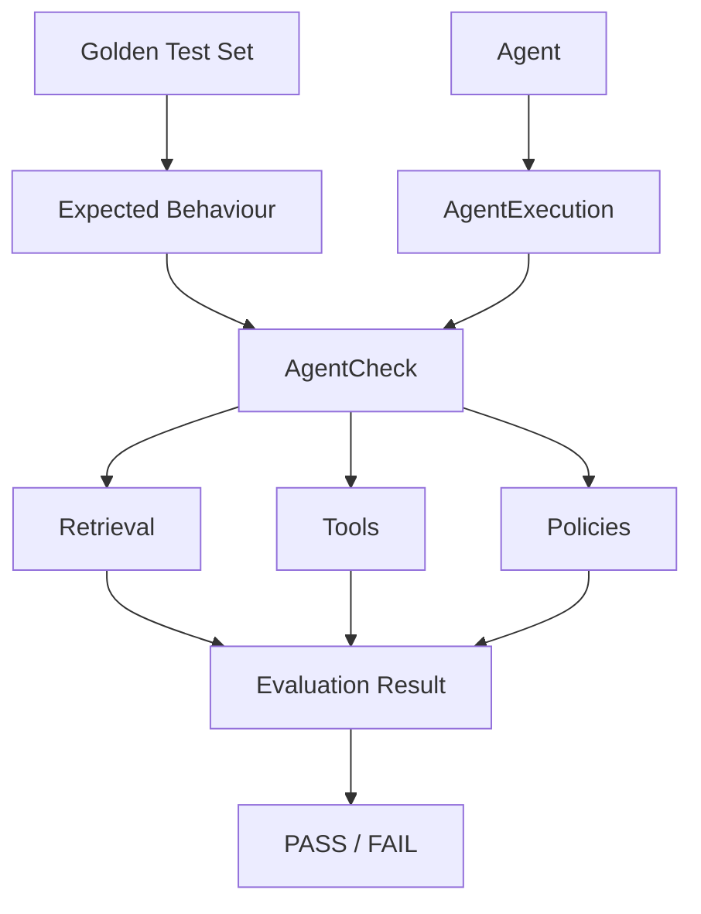

# AgentCheck

> Deterministic regression testing for Java AI agents.

AgentCheck tests observable AI-agent behaviour against golden test cases.

It evaluates retrieval results, tool usage and policy violations using explicit,
deterministic rules — without requiring an LLM-as-a-judge.

Bring your agent. We'll test its behaviour.

## Why AgentCheck exists

Changing a model, system prompt, retrieval configuration, tool definition, or
orchestration layer can silently change an agent's observable behaviour.
AgentCheck answers one narrow question: **did the agent behave the way its
golden test set says it should?**

AgentCheck complements broader evaluation frameworks. It deliberately focuses
on deterministic, behaviour-oriented, regression-focused, golden-test-based,
Java-native evaluation.

## What problem it solves

AgentCheck compares explicit expectations with either a live adapter result or
a recorded execution. Evaluation is repeatable, produces visible reasons for
failure, and ends in a CI-friendly `PASS` or `FAIL`. No model judges another
model, and there is no opaque composite quality score.

## Golden test sets

Golden YAML is intended to be readable without framework knowledge:

```yaml
suite: customer-support
retrievalK: 5

cases:
  - id: shipping-status
    description: Order tracking must retrieve policy before using tools
    tags: [smoke, support]
    enabled: true
    input: Where is my order?
    expected:
      retrieval:
        relevantDocuments: [shipping-policy.md]
      tools:
        required: [get_order, get_shipping_status]
        forbidden: [cancel_order]

thresholds:
  retrieval:
    recallAt5: 0.80
    mrr: 0.75
  tools:
    accuracy: 0.90
  policy:
    maxViolations: 0
```

All expectation sections and metadata fields are optional. `enabled` defaults
to `true`; disabled cases are reported as skipped and are never sent to an
adapter. `retrievalK` defaults to 5. A recall
threshold may be named for the configured cutoff (for example `recallAt5`) or
use the generic key `recallAtK`.

Select a deterministic subset by matching any requested tag:

```java
GoldenTestSuite smokeSuite = GoldenTestSuite.load("support-agent.yaml")
        .selectByTags("smoke", "critical");
```

## Expected vs actual behaviour

`GoldenTestCase` contains expectations. `AgentExecution` contains only facts:
the input, answer, retrieved documents, and tool calls. Keeping the two models
separate makes recorded executions reusable and prevents expectations from
leaking into traces.



## Quick Start

Requirements: JDK 21. The Gradle wrapper pins the build tool. Dependency
artifacts need to be present in the local Gradle cache for a first offline
build; running once online populates that cache. AgentCheck itself makes no
network calls and needs no API keys.

```bash
./gradlew test
./gradlew run
```

Integrate any implementation through one method:

```java
AgentAdapter agent = input -> new AgentExecution(
    input,
    "Your order is in transit.",
    List.of(new RetrievedDocument("shipping-policy.md", 1)),
    List.of(new ToolCall("get_order"))
);

GoldenTestSuite suite = GoldenTestSuite.load("support-agent.yaml");
EvaluationSuiteResult result = new AgentCheck().evaluate(agent, suite);
```

To avoid running an agent, pass executions keyed by case ID:

```java
EvaluationSuiteResult result = new AgentCheck().evaluate(
    suite,
    Map.of("shipping-status", recordedExecution)
);
```

One case can be evaluated directly with
`new AgentCheck().evaluate(goldenCase, recordedExecution)`.

## Record golden-test drafts

v0.4 can bootstrap a golden suite from live agent executions. Generated cases
are always disabled drafts: AgentCheck records what happened, but never assumes
that the observed behaviour is correct.

Run the included example without writing any Java code:

```bash
./gradlew clean recordExample
```

The generated draft is written to
`build/agentcheck/customer-support-draft.yaml`. `clean` removes the previous
build output; the recorder itself still refuses to overwrite an existing file.

```java
GoldenTestRecorder recorder = new GoldenTestRecorder();
List<TestInput> inputs = List.of(
        new TestInput("shipping-status", "Where is my order?"),
        new TestInput("refund", "Refund my last order"));

GoldenTestSuiteDraft draft = recorder.record(agent, "customer-support", inputs);
draft.writeNew(Path.of("customer-support-draft.yaml"));
```

Every retrieved document becomes a proposed relevant document and every called
tool becomes a proposed required tool. Duplicate document and tool names are
removed while their observed order is preserved. Forbidden tools and answer
expectations are never inferred. Review and edit those decisions before
changing a generated case from `enabled: false` to `enabled: true`.

Capture executions as versioned JSON when recording and review happen at
different times or in different environments:

```java
RecordedTestSuite recording = recorder.capture(agent, "customer-support", inputs);
recording.writeNew(Path.of("customer-support-recording.json"));

RecordedTestSuite savedRecording = RecordedTestSuite.loadJson(
        Path.of("customer-support-recording.json"));
GoldenTestSuiteDraft draft = recorder.fromExecutions(savedRecording);
```

Safe defaults omit observed answer text and tool arguments, which may contain
sensitive data. They can be included explicitly when appropriate:

```java
RecordingOptions options = new RecordingOptions(5, true, true);
GoldenTestRecorder recorder = new GoldenTestRecorder(options);
```

`writeNew` uses create-only file semantics and fails if the target already
exists. It never overwrites a committed golden suite.

The complete review workflow is:

1. Run `./gradlew clean recordExample` or call `GoldenTestRecorder` from the
   application.
2. Open the generated YAML and inspect every proposed document and tool.
3. Remove accidental observations and add forbidden tools or other missing
   expectations manually.
4. Change only reviewed cases from `enabled: false` to `enabled: true`.
5. Move the reviewed suite into the project's test data and commit it.
6. Load it with `GoldenTestSuite.load(...)` in the normal AgentCheck test.

Both recording JSON and generated YAML carry `schemaVersion: 1`. Recording
errors identify the failing input and do not write a partial draft.

## Spring AI integration

The Spring AI adapter lives in the separate `agentcheck-spring-ai` module.
Applications using the adapter depend on that module; its API dependency brings
in both `agentcheck-core` and the compatible Spring AI client:

```groovy
dependencies {
    implementation project(':agentcheck-spring-ai')
}
```

Applications that do not use Spring AI depend only on `agentcheck-core` and do
not receive Spring AI classes or transitive dependencies. Published Maven
coordinates will replace the project dependency after the first Maven Central
release.

Pass an already configured `ChatClient`; AgentCheck does not choose a model,
provider, credentials, tools, or advisors:

```java
ChatClient chatClient = ChatClient.builder(chatModel)
        .defaultAdvisors(questionAnswerAdvisor)
        .defaultTools(orderTools)
        .build();

AgentAdapter agent = new SpringAiAgentAdapter(chatClient);
EvaluationSuiteResult result = new AgentCheck().evaluate(agent, suite);
```

The adapter maps the final answer, tool calls from Spring AI's tool-calling
loop, and documents exposed by `QuestionAnswerAdvisor` under
`qa_retrieved_documents` into an `AgentExecution`. Returned document order
becomes rank 1, 2, and so on; Spring AI similarity scores are preserved.

Spring AI document IDs are generated unless the application assigns them. To
compare a stable source name from document metadata instead, provide an
extractor:

```java
SpringAiAgentAdapter adapter = new SpringAiAgentAdapter(
        chatClient,
        document -> (String) document.getMetadata().get("source"));
```

Tool arguments are retained as JSON objects even though deterministic argument
matching is not yet part of AgentCheck's evaluator. Streaming is deliberately
outside the v0.3 adapter.

## MCP integration

The `agentcheck-mcp` module maps tool requests from the official MCP Java SDK
2.0.1 into AgentCheck execution traces without starting a client or server:

```groovy
dependencies {
    implementation project(':agentcheck-mcp')
}
```

```java
CallToolRequest request = CallToolRequest.builder("get_order")
        .arguments(Map.of("orderId", 42))
        .build();

AgentExecution execution = new McpExecutionMapper().map(
        "Where is my order?",
        "Your order is in transit.",
        List.of(new RetrievedDocument("shipping-policy.md", 1)),
        List.of(request));
```

The caller remains responsible for observing requests at its MCP client or
server boundary and for providing the agent input, final answer, and retrieved
documents. MCP itself does not define an agent's final answer, so AgentCheck
does not infer one. Request order, tool names, and JSON arguments are preserved;
tool results and network transport are deliberately outside this mapper.

## Regression comparison

v0.2 compares a baseline and current evaluation without inventing a composite
score:

```java
EvaluationSuiteResult baseline = EvaluationSuiteResult.loadJson(Path.of("baseline.json"));
EvaluationSuiteResult current = new AgentCheck().evaluate(agent, suite);
RegressionResult regression = new AgentCheck().compare(baseline, current);

new ConsoleReporter().print(regression, System.out);
```

A comparison fails when Recall@k, MRR, or tool accuracy decreases, or when the
number of failed cases, missing tools, unexpected tools, or policy violations
increases. An applicable baseline metric becoming `N/A` is also a regression;
a newly applicable metric is not. Metric changes include absolute and relative
deltas. Results must have the same suite name, retrieval cutoff, and evaluated
case IDs so that unrelated datasets cannot be compared accidentally.

Both `EvaluationSuiteResult` and `RegressionResult` provide `toJson()` for
stable, readable artifacts.

## Retrieval evaluation

AgentCheck orders retrieved documents by ascending declared rank, removes
duplicate IDs after their first occurrence, and preserves each retained
document's declared rank.

- **Recall@k** is the number of unique relevant document IDs in the first `k`
  unique results divided by the number of unique relevant IDs.
- **Reciprocal Rank** is `1 / rank` for the first relevant document in that
  normalized ranking, or zero when no relevant document was retrieved.
- **MRR** is the arithmetic mean of reciprocal rank across applicable cases.

An empty result has zero recall and reciprocal rank when relevance judgments
exist. A relevant result outside `k` contributes to reciprocal rank but not
Recall@k. With no relevant documents, retrieval is `N/A`, not zero, and is
excluded from suite aggregation. A retrieval case passes its behavioural check
only when Recall@k is 1.0; suite thresholds can enforce aggregate minima.

This mirrors a familiar Information Retrieval pattern:

```text
Traditional IR: Queries + Relevance Judgments + Ranked Results -> Metrics
AgentCheck:     Inputs  + Expected Behaviour  + Execution Traces -> Deterministic Evaluation
```

This is conceptual inspiration, not a claim of a novel research contribution.

## Tool behaviour

Calls are compared by tool name; arguments are intentionally ignored in v0.1.
Duplicate calls count once. Required calls are present or missing. Calls named
as forbidden are reported separately from unexpected calls, which are names in
neither expected list.

Tool accuracy is the number of satisfied assertions (required tools called plus
forbidden tools not called) divided by all required and forbidden assertions
plus unexpected calls. Suite tool accuracy is the mean across cases with tool
expectations. With no tool expectations, evaluation is `N/A` and calls are not
judged.

## Policy violations

In v0.1, and only in v0.1's deliberately small policy model, each distinct
forbidden tool call is a `FORBIDDEN_TOOL_CALL` violation. This is not presented
as a complete guardrail system.

## JUnit usage

```java
@Test
void supportAgentRegression() {
    GoldenTestSuite suite = GoldenTestSuite.load("support-agent.yaml");
    EvaluationSuiteResult result = new AgentCheck().evaluate(agent, suite);

    assertThat(result.status()).isEqualTo(EvaluationStatus.PASS);
    AgentCheckAssertions.assertThat(result).hasNoPolicyViolations();
}
```

## CI

The included GitHub Actions workflow runs `./gradlew test` on JDK 21. Evaluation
results serialize through `result.toJson()` and can be loaded later as
regression baselines.

## Architecture

The `agentcheck-core` module contains the `AgentCheck` facade and `AgentAdapter`,
immutable execution/golden records, immutable result records, the console
reporter, and one assertion helper. Parsing and metric calculations remain
behind the facade. The `agentcheck-spring-ai` and `agentcheck-mcp` modules
contain optional framework integrations and declare their SDKs as explicit API
dependencies. Core evaluation has no framework runtime dependency, and there
are no LangChain4j, database, or telemetry dependencies.

## Example

[`examples/customer-support`](examples/customer-support) contains three tiny
documents, a golden suite, and `FakeSupportAgent`. The fake is deterministic and
is not presented as an AI agent. Run it with `./gradlew run`.

## What AgentCheck does NOT do

AgentCheck does not orchestrate agents, implement RAG, score semantic answer
quality, manage prompts, trace distributed systems, provide a UI, or call an
LLM as a judge. It is not a generic policy engine and does not replace broader
evaluation platforms.

## Roadmap

- TODO before publishing to Maven Central: register and verify the
  `io.github.agentcheck4j` namespace, then configure signed publication of
  `agentcheck-core`, `agentcheck-spring-ai`, and `agentcheck-mcp`
- v0.5: MCP execution mapping
- Future: LangChain4j, tool argument matching, nDCG, latency and token/cost
  thresholds, optional LLM-based evaluators, and OpenTelemetry trace import

No release dates are implied.

## Contributing

See [CONTRIBUTING.md](CONTRIBUTING.md). Small, deterministic additions with
clear tests are preferred over broad abstractions.

## License

MIT License. See [LICENSE](LICENSE).
